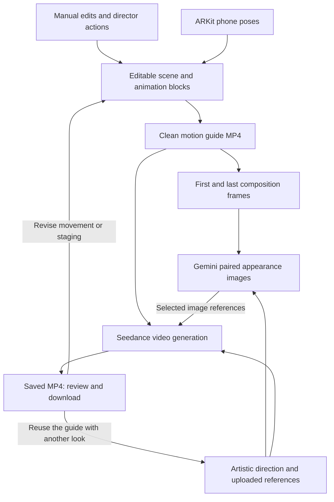

# Composition — Devpost story draft

**Tagline:** Gemini-powered filmmaking: direct with your voice, film with your phone, and bring your composition to life.

## Inspiration

I wanted AI filmmaking to preserve the freedom of finding a shot: moving around a subject, choosing an angle, and directing a performance. Composition turns those physical and creative decisions into inputs for generation. Codex made tackling this scope as a solo hacker possible.

## What it does

Composition is an agentic videography tool. Gemini Live provides conversational direction, Gemini plans scene edits, and a connected phone controls the virtual camera. Users save movement in reusable animation blocks, generate a visual treatment with Gemini, and use the composition to guide video generation.

## How we built it

**The filmmaking pipeline**

1. **Direct with Gemini.** Gemini receives scene state and a viewport image, returning typed actions for objects, cameras, and animation. Gemini Live calls this workflow through voice; Hunyuan supplies generated character motion. Changes are validated and approved before application.
2. **Film and preserve movement.** ARKit sends phone position and orientation through a WebSocket relay. The Three.js editor maps those poses to the virtual camera and saves interpolated motion as editable timeline blocks. Blocks retain source keyframes when split, retimed, or reused.
3. **Render the composition.** The saved camera and animation tracks become a clean 720p, 30 fps motion guide. This captures staging, timing, and camera movement independently of the phone's preview stream.
4. **Develop the look with Gemini.** Gemini refines artistic prompts and generates styled first and last frames. Gemini receives the styled first image when creating the last, providing a shared appearance reference while retaining the ending composition.
5. **Generate and review.** Seedance receives the motion guide, selected Gemini images, and direction prompt. The guide supplies motion and framing; Gemini images supply appearance. The pipeline saves returned video for review and download. Users can reuse the guide for another visual treatment.

**Solo development with Codex**

Codex made the scope manageable for one developer. Local repository access, terminal commands, browser research, MCP tools, and Git diff inspection kept implementation and review in one workspace.

The less visible features mattered: `AGENTS.md` carried project instructions, a reusable skill required verification and commits, and interactive steering let me refine requirements during ongoing work. Codex also helped turn implementation lessons into persistent notes, including preserving rotation paths, rejecting stale proposals, and keeping interrupted generation requests recoverable. I could return to the reasoning behind a fix as the project evolved.

## Challenges we ran into

Handheld latency required separating tracking from rendering. I kept the scene renderer on desktop, capped phone poses at 30 Hz, and sent 480×270 previews at roughly 6 fps. Backpressure controls prevent preview queues from accumulating.

Gemini also needed a reliable execution contract. I compacted Gemini's output schema while keeping strict application-side validation, and used scene signatures to stop stale agent proposals or generation guides from being applied to newer edits.

## Accomplishments that we're proud of

- Building a solo project spanning spatial editing, phone tracking, voice direction, and media generation with Codex.
- Using Gemini across conversation, scene planning, prompt refinement, and image generation.
- Validating a live Gemini object proposal and converting a two-second Hunyuan performance into 19 editable tracks.
- Preserving authored motion through reusable blocks and a rendered generation guide.

## What we learned

Gemini becomes more useful when it operates on explicit scene state and visual context. Codex becomes more useful when work has clear boundaries, reusable instructions, and reviewable results. Those two ideas shaped both Composition and how I built it.

## What's next for Composition

My next development pass focuses on:

- **ElevenLabs audio:** generate audio for the finished output and combine it with the video through FFmpeg.
- **Codex cloud sandboxes:** compare Gemini appearance-conditioning approaches in isolated environments using the same composition.
- **Parallel agents and worktrees:** separate handheld transport, generation reliability, and UI review into independent tasks and checkouts.
- **Overnight automations:** schedule rotation, tracking-loss, and export regression checks, then review results in the morning.

## Built with

Gemini, Gemini Live, OpenAI Codex, Three.js, React, TypeScript, Node.js, ARKit, WebSockets, Zod, FFmpeg, Hunyuan Motion, Seedance, fal. Planned audio integration: ElevenLabs.

---

## Implementation references — not submission copy

The current repository implements **Seedance via fal**, not Veo. The draft reflects that implementation. Capture rates are code settings; device performance and generative fidelity are not presented as measured results.

The author clarified that ElevenLabs and the proposed cloud/overnight experiments have not yet been completed. They appear as planned work. `AGENTS.md` supplies project instructions; reusable skills are defined separately in `SKILL.md`.

The specific live Gemini proposal and two-second/19-track motion result are recorded in [the Director implementation notes](C:/Users/Justin/comp/plans/gemini-director-integration.md). Those notes distinguish limited smoke checks from full live microphone acceptance. [Implementation lessons](C:/Users/Justin/comp/tasks/lessons.md) distinguish local/browser checks with mocked providers from paid end-to-end video acceptance.

Codex cloud environments create repository-backed containers for execution; this supports the proposed isolation approach. See the [official cloud environment documentation](https://learn.chatgpt.com/docs/environments/cloud-environment). [Subagent workflows](https://learn.chatgpt.com/docs/agent-configuration/subagents) support independent parallel tasks, while [worktrees](https://learn.chatgpt.com/docs/environments/git-worktrees) separate checkouts.

[Scheduled tasks](https://learn.chatgpt.com/docs/automations?surface=app) can run background project work; local runs require the computer and app to remain on. The proposed overnight checks have not been scheduled in this conversation. [Reusable skills](https://learn.chatgpt.com/docs/build-skills) package workflows in `SKILL.md`; the existing [commit-after-change skill](C:/Users/Justin/comp/.agents/skills/commit-after-change/SKILL.md) and [AGENTS.md](C:/Users/Justin/comp/AGENTS.md) provide the concrete project example.

- Handheld transport and preview: [MotionController.swift](C:/Users/Justin/comp/ios/CompositionCamera/MotionController.swift), [phoneRelay.ts](C:/Users/Justin/comp/server/phoneRelay.ts), [phoneCamera.ts](C:/Users/Justin/comp/src/scene/phoneCamera.ts).
- Alignment, interpolation, and rotation continuity: [phoneMotion.ts](C:/Users/Justin/comp/src/core/phoneMotion.ts).
- Director actions, versioning, and compact schema: [director.ts](C:/Users/Justin/comp/src/core/director.ts), [server director](C:/Users/Justin/comp/server/director.ts), [directorSchema.ts](C:/Users/Justin/comp/server/directorSchema.ts), [directorLive.ts](C:/Users/Justin/comp/server/directorLive.ts).
- Source-preserving animation blocks: [clips.ts](C:/Users/Justin/comp/src/core/clips.ts), [animationLibrary.ts](C:/Users/Justin/comp/src/core/animationLibrary.ts).
- Guide capture, paired image references, and video jobs: [guideExport.ts](C:/Users/Justin/comp/src/scene/guideExport.ts), [imageJobs.ts](C:/Users/Justin/comp/server/imageJobs.ts), [providers.ts](C:/Users/Justin/comp/server/providers.ts), [jobs.ts](C:/Users/Justin/comp/server/jobs.ts).
- Clean export and timeline sampling: [Viewport.tsx](C:/Users/Justin/comp/src/scene/Viewport.tsx:350), [project.ts](C:/Users/Justin/comp/src/core/project.ts:160).
- MP4 normalization and endpoint extraction: [media.ts](C:/Users/Justin/comp/server/media.ts).
- Artistic direction and reference ordering: [promptRefinement.ts](C:/Users/Justin/comp/server/promptRefinement.ts), [proposals.ts](C:/Users/Justin/comp/src/core/proposals.ts:27).
- Review, baseline selection, completion, and iteration: [OutputPage.tsx](C:/Users/Justin/comp/src/components/OutputPage.tsx), [OutputImages.tsx](C:/Users/Justin/comp/src/components/OutputImages.tsx).

### Workflow diagram

The phone's JPEG preview is a framing monitor. It is not used as the model's motion guide. The guide's configured 30 fps and the model's interpretation of its motion are distinct: the pipeline supplies temporal reference footage, not a guarantee of frame-exact generative reproduction. Generated baseline images are optional; the diagram shows the workflow when a pair is selected. Current video requests use a whole duration of 4–10 seconds, 720p, 16:9, audio disabled, and at most nine reference images.
