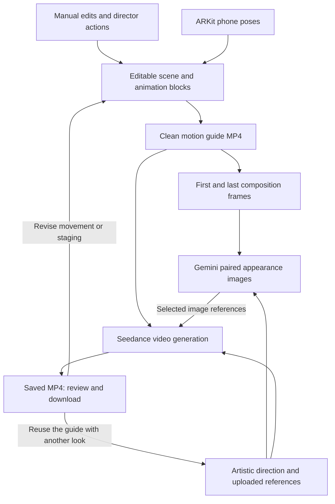

# Composition — Devpost story draft

**Tagline:** Agentic videography: film with your phone, direct with your voice, generate from your composition.

## Inspiration

We wanted AI filmmaking to preserve the physical process of finding a shot: moving around a subject, choosing an angle, and directing its performance. Composition makes those decisions editable inputs to video generation.

## What it does

Composition combines a Three.js scene editor, phone-controlled camera capture, and a live voice director. Users place objects, direct character animation, and record camera movement. Reusable animation blocks preserve the authored motion; the composed scene becomes a guide for generated imagery and video.

## How we built it

**1. Stage and direct the scene.** Users arrange objects manually or through Gemini Live. The director receives structured scene state and a viewport image, then proposes typed placement, camera, and animation actions. Zod validation, approval, and scene-signature checks precede application. Hunyuan generates humanoid performances asynchronously, which become editable animation tracks.

**2. Capture the camera movement.** An ARKit companion sends position and quaternion orientation through a Node WebSocket relay. The editor receives pose events over SSE and returns rendered JPEG previews. A rigid alignment transform anchors physical movement to the starting virtual camera. Recorded poses are resampled at 30 fps with linear position interpolation, quaternion SLERP, and rotation unwrapping.

**3. Edit and reuse the take.** Camera, object, and character motion live in timeline blocks. Each block retains its source keyframes and source-time window, so splitting, retiming, and saving it preserve the original motion data. Users can adjust timing and framing before spending on generation.

**4. Render the motion guide.** We snapshot the project and replay its object transforms, joint animation, and camera tracks together through the scene sampler. A clean export hides editor controls and renders from the shot camera at 1280×720. Browser recording and FFmpeg produce a 30 fps MP4 for review. This guide visually carries the staged action, timing, framing, and camera movement into the video model. It is rendered from the saved composition, independently of the low-rate phone preview.

**5. Define appearance without rebuilding the motion.** Users add artistic direction and optional reference images. Optional Gemini prompt refinement uses the composition frame and uploaded references, with instructions to respect the existing movement and timing. For a generated visual baseline, FFmpeg extracts the guide's first and last frames. Gemini renders the first frame in the requested style, then receives both the last composition frame and the styled first image to generate a matching end image. This gives the ending pose its own composition reference and a shared appearance reference.

**6. Assemble the video-model inputs.** After the user selects a baseline pair, Seedance via fal receives the full motion guide as `@Video1`, the styled first and last images as `@Image1` and `@Image2`, any additional selected references, and the video-direction prompt. We explicitly instruct it to follow the guide's animation, staging, and camera framing while taking identity, materials, lighting, and color from the images. The video model receives these visual references; the editable 3D scene and keyframes remain in Composition. They guide generation rather than impose exact geometric constraints on its output.

**7. Generate, review, and iterate.** The server verifies that the guide matches the current scene and that the selected baseline came from that guide. It persists the request before submitting, polls the provider, and stores the returned MP4 for playback and download. Request IDs make retries reuse the same request; fingerprints reject changed inputs under an existing ID. Users can create another visual version from the same motion guide, or revise the composition and export a new one.

## Challenges we ran into

Handheld latency was the main architectural tradeoff. We kept rendering in the desktop editor and decoupled tracking from preview delivery: poses are capped at 30 Hz, while 480×270 JPEG previews are capped at roughly 6 fps. Single in-flight sends and dropping previews under socket backpressure limit queue buildup.

Agent execution also had to tolerate a changing scene. Proposals carry a scene signature and revision; if editing makes a result stale, it requires review before application. We also compacted the model-facing JSON schema to fit Gemini's constraints while retaining full application-side validation.

## Accomplishments that we're proud of

- Representing handheld takes, manual animation, and generated motion as editable timeline blocks.
- Connecting live voice direction to validated scene operations.
- Separating motion guidance from appearance references in the generation pipeline.

## What we learned

Separating tracking, preview rendering, and generation lets each run at an appropriate rate. Keeping motion as structured data makes physical capture reusable throughout the workflow.

## What's next for Composition

Measure handheld latency and tracking drift on devices, tune preview delivery across networks, and evaluate how consistently generated video follows the authored camera and character motion.

---

## Implementation references — not submission copy

The current repository implements **Seedance via fal**, not Veo. The draft reflects that implementation. Capture rates are code settings; device performance and generative fidelity are not presented as measured results.

- Handheld transport and preview: [MotionController.swift](C:/Users/Justin/comp/ios/CompositionCamera/MotionController.swift), [phoneRelay.ts](C:/Users/Justin/comp/server/phoneRelay.ts), [phoneCamera.ts](C:/Users/Justin/comp/src/scene/phoneCamera.ts).
- Alignment, interpolation, and rotation continuity: [phoneMotion.ts](C:/Users/Justin/comp/src/core/phoneMotion.ts).
- Director actions, versioning, and compact schema: [director.ts](C:/Users/Justin/comp/src/core/director.ts), [server director](C:/Users/Justin/comp/server/director.ts), [directorSchema.ts](C:/Users/Justin/comp/server/directorSchema.ts), [directorLive.ts](C:/Users/Justin/comp/server/directorLive.ts).
- Source-preserving animation blocks: [clips.ts](C:/Users/Justin/comp/src/core/clips.ts), [animationLibrary.ts](C:/Users/Justin/comp/src/core/animationLibrary.ts).
- Guide capture, paired image references, and video jobs: [guideExport.ts](C:/Users/Justin/comp/src/scene/guideExport.ts), [imageJobs.ts](C:/Users/Justin/comp/server/imageJobs.ts), [providers.ts](C:/Users/Justin/comp/server/providers.ts), [jobs.ts](C:/Users/Justin/comp/server/jobs.ts).
- Clean export and timeline sampling: [Viewport.tsx](C:/Users/Justin/comp/src/scene/Viewport.tsx:350), [project.ts](C:/Users/Justin/comp/src/core/project.ts:160).
- MP4 normalization and endpoint extraction: [media.ts](C:/Users/Justin/comp/server/media.ts).
- Artistic direction and reference ordering: [promptRefinement.ts](C:/Users/Justin/comp/server/promptRefinement.ts), [proposals.ts](C:/Users/Justin/comp/src/core/proposals.ts:27).
- Review, baseline selection, completion, and iteration: [OutputPage.tsx](C:/Users/Justin/comp/src/components/OutputPage.tsx), [OutputImages.tsx](C:/Users/Justin/comp/src/components/OutputImages.tsx).

### Workflow diagram

The phone's JPEG preview is a framing monitor. It is not used as the model's motion guide. The guide's configured 30 fps and the model's interpretation of its motion are distinct: the pipeline supplies temporal reference footage, not a guarantee of frame-exact generative reproduction. Generated baseline images are optional; the diagram shows the workflow when a pair is selected. Current video requests use a whole duration of 4–10 seconds, 720p, 16:9, audio disabled, and at most nine reference images.
