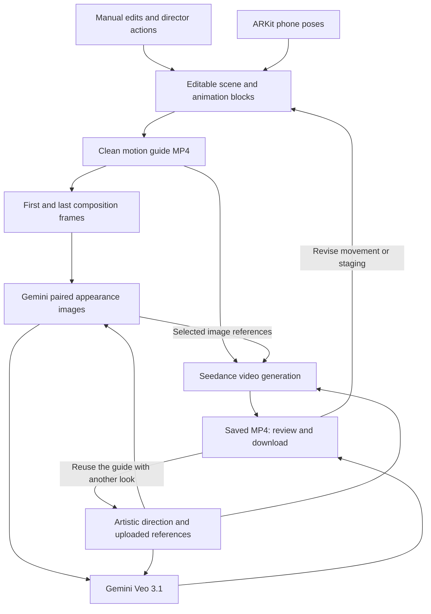

# Composition — Devpost story draft

**Tagline:** Gemini- and ElevenLabs-powered filmmaking: direct with your voice, film with your phone, and bring your composition to life.

## Inspiration

I wanted AI filmmaking to preserve the freedom of finding a shot: moving around a subject, choosing an angle, and directing a performance. Composition turns those physical and creative decisions into inputs for generation. Codex made tackling this scope as a solo hacker possible.

## What it does

Composition is an agentic videography tool. Gemini Live provides conversational direction, Gemini plans scene edits, ElevenLabs speaks finalized Director replies, and a connected phone controls the virtual camera. Users save movement in reusable animation blocks, develop a visual treatment with Gemini, and choose between Seedance and Gemini Veo for video generation.

## How we built it

**The filmmaking pipeline**

1. **Direct with Gemini and ElevenLabs.** Gemini receives scene state and a viewport image, returning typed actions for objects, cameras, and animation. Gemini Live carries the conversational voice direction; after a reply is finalized, ElevenLabs synthesizes it as audio through a server-side voice proxy. Replies play completely and sequentially, and Director waits for the next turn while audio is preparing or playing. If information is missing, it asks one concise question and waits rather than guessing. Hunyuan supplies generated character motion. Changes are validated and approved before application.
2. **Film and preserve movement.** ARKit sends phone position and orientation through a WebSocket relay. The Three.js editor maps those poses to the virtual camera and saves interpolated motion as editable timeline blocks. Blocks retain source keyframes when split, retimed, or reused.
3. **Render the composition.** The saved camera and animation tracks become a clean 720p, 30 fps motion guide. This captures staging, timing, and camera movement independently of the phone's preview stream.
4. **Develop the look with Gemini.** Gemini refines artistic prompts and generates styled first and last frames. Gemini receives the styled first image when creating the last, providing a shared appearance reference while retaining the ending composition.
5. **Generate with Seedance or Gemini Veo.** Seedance receives the motion guide, selected Gemini images, and direction prompt: the guide supplies motion and framing while the images supply appearance. Gemini Veo 3.1 is an alternate Gemini API path for 4-, 6-, or 8-second 720p clips; it uses the direction and selected baseline/reference images, describes movement in the prompt, and returns generated audio. Veo does not receive the phone motion guide, so the user can intentionally choose authored motion (Seedance) or prompt-and-image-driven generation (Veo).
6. **Review and iterate.** The pipeline saves returned video for review and download. Users can revise movement or staging, or reuse the composition for another visual treatment.

**Solo development with Codex**

Codex made Composition manageable as a solo build by connecting repository access, terminal execution, browser research, MCP tools, and Git diff inspection in one development environment.

The most useful features were the ones that made the development process repeatable:

- **Project instructions and reusable skills.** `AGENTS.md` defined the repository's validation commands, while a separate `SKILL.md` workflow required scoped checks, diff inspection, and a commit for each completed change.
- **Interactive steering.** I could refine requirements during ongoing work while keeping the conversation's implementation context.
- **Persistent implementation notes.** Codex helped document rotation continuity, stale Gemini proposals, and recoverable generation requests, so later work could build on previous debugging.
- **Tool use grounded in the repository.** Codex could connect an architectural claim to the actual renderer, relay, or provider implementation, then make and review the corresponding edit.

## Challenges we ran into

Handheld mode was initially too slow because camera tracking and video previews competed for the same connection. I separated them: the phone streams motion at up to 30 fps, while the desktop sends back a lightweight preview at roughly 6 fps and drops old frames when the connection falls behind.

Gemini also needed to make safe, predictable edits. I gave it a compact set of typed actions, validated every response, and tied each proposal to the exact scene it was created for. If the scene changes, Composition asks Gemini to refresh the proposal instead of applying an outdated edit.

## Accomplishments that we're proud of

- Building a solo project spanning spatial editing, phone tracking, voice direction, and media generation with Codex.
- Using Gemini across conversation, scene planning, prompt refinement, image generation, and Veo video generation.
- Adding ElevenLabs as a reliable spoken response layer for Director, with complete, non-overlapping playback and clarification turns that wait for the user's next message.
- Validating a live Gemini object proposal and converting a two-second Hunyuan performance into 19 editable tracks.
- Preserving authored motion through reusable blocks and a rendered generation guide.

## What we learned

Gemini becomes more useful when it operates on explicit scene state and visual context. Codex becomes more useful when work has clear boundaries, reusable instructions, and reviewable results. Those two ideas shaped both Composition and how I built it.

## What's next for Composition

My next development pass focuses on:

- **Finished-film audio:** extend the current ElevenLabs Director voice layer into optional narration or dialogue tracks mixed into exported video through FFmpeg.
- **Codex cloud sandboxes:** compare Gemini appearance-conditioning approaches in isolated environments using the same composition.
- **Task forks, parallel agents, and worktree handoff:** branch an investigation with its conversation context, give independent implementation tasks separate checkouts, and bring a task and its code back to the local checkout for integration.
- **Browser annotations and inline review:** point Codex at specific timeline or director-panel elements, reproduce browser interactions, and attach code feedback to exact diff lines.
- **Overnight automations backed by skills:** package rotation, tracking-loss, and export checks into a repeatable workflow, schedule it, and review failures in the morning.
- **Remote control from my phone:** steer development tasks and inspect diffs while away from the desktop during handheld testing.

## Built with

Gemini, Gemini Live, Gemini Veo 3.1, ElevenLabs, OpenAI Codex, Three.js, React, TypeScript, Node.js, ARKit, WebSockets, Zod, FFmpeg, Hunyuan Motion, Seedance, fal.

---

## Implementation references — not submission copy

The current repository implements both **Seedance via fal** and **Gemini Veo 3.1**. It also implements ElevenLabs speech for finalized Director replies. Capture rates are code settings; device performance and generative fidelity are not presented as measured results.

The proposed cloud/overnight experiments remain future work. `AGENTS.md` supplies project instructions; reusable skills are defined separately in `SKILL.md`.

The description emphasizes Codex's integrated workflow without claiming that skills, MCP, agents, or worktrees are exclusive to Codex. Official product documentation establishes feature availability, not competitor-wide exclusivity. Task forks, worktree handoff, browser annotations, inline review, and phone-based Remote control are proposed next steps here, not claims of completed use.

[Worktree handoff](https://learn.chatgpt.com/docs/environments/git-worktrees) moves a task and its code between a managed worktree and the local checkout; a conversation fork is a separate operation that preserves conversation history. [OpenAI's Remote workflow guide](https://developers.openai.com/blog/mastering-codex-remote-for-engineering) documents forks, steering, side chats, durable goals, and phone-based review. [Browser tooling](https://learn.chatgpt.com/docs/browser) supports page annotations and interactions, while [code review](https://learn.chatgpt.com/docs/code-review) supports feedback on exact diff lines. These are distinct from the repository-backed cloud containers described below.

The specific live Gemini proposal and two-second/19-track motion result are recorded in [the Director implementation notes](C:/Users/Justin/comp/plans/gemini-director-integration.md). Those notes distinguish limited smoke checks from full live microphone acceptance. [Implementation lessons](C:/Users/Justin/comp/tasks/lessons.md) distinguish local/browser checks with mocked providers from paid end-to-end video acceptance.

Codex cloud environments create repository-backed containers for execution; this supports the proposed isolation approach. See the [official cloud environment documentation](https://learn.chatgpt.com/docs/environments/cloud-environment). [Subagent workflows](https://learn.chatgpt.com/docs/agent-configuration/subagents) support independent parallel tasks, while [worktrees](https://learn.chatgpt.com/docs/environments/git-worktrees) separate checkouts.

[Scheduled tasks](https://learn.chatgpt.com/docs/automations?surface=app) can run background project work; local runs require the computer and app to remain on. The proposed overnight checks have not been scheduled in this conversation. [Reusable skills](https://learn.chatgpt.com/docs/build-skills) package workflows in `SKILL.md`; the existing [commit-after-change skill](C:/Users/Justin/comp/.agents/skills/commit-after-change/SKILL.md) and [AGENTS.md](C:/Users/Justin/comp/AGENTS.md) provide the concrete project example.

- Handheld transport and preview: [MotionController.swift](C:/Users/Justin/comp/ios/CompositionCamera/MotionController.swift), [phoneRelay.ts](C:/Users/Justin/comp/server/phoneRelay.ts), [phoneCamera.ts](C:/Users/Justin/comp/src/scene/phoneCamera.ts).
- Alignment, interpolation, and rotation continuity: [phoneMotion.ts](C:/Users/Justin/comp/src/core/phoneMotion.ts).
- Director actions, versioning, and compact schema: [director.ts](C:/Users/Justin/comp/src/core/director.ts), [server director](C:/Users/Justin/comp/server/director.ts), [directorSchema.ts](C:/Users/Justin/comp/server/directorSchema.ts), [directorLive.ts](C:/Users/Justin/comp/server/directorLive.ts).
- Source-preserving animation blocks: [clips.ts](C:/Users/Justin/comp/src/core/clips.ts), [animationLibrary.ts](C:/Users/Justin/comp/src/core/animationLibrary.ts).
- Guide capture, paired image references, and video jobs: [guideExport.ts](C:/Users/Justin/comp/src/scene/guideExport.ts), [imageJobs.ts](C:/Users/Justin/comp/server/imageJobs.ts), [providers.ts](C:/Users/Justin/comp/server/providers.ts), [jobs.ts](C:/Users/Justin/comp/server/jobs.ts).
- Clean export and timeline sampling: [Viewport.tsx](C:/Users/Justin/comp/src/scene/Viewport.tsx:350), [project.ts](C:/Users/Justin/comp/src/core/project.ts:160).
- MP4 normalization and endpoint extraction: [media.ts](C:/Users/Justin/comp/server/media.ts).
- Artistic direction and reference ordering: [promptRefinement.ts](C:/Users/Justin/comp/server/promptRefinement.ts), [proposals.ts](C:/Users/Justin/comp/src/core/proposals.ts:27).
- Review, baseline selection, completion, and iteration: [OutputPage.tsx](C:/Users/Justin/comp/src/components/OutputPage.tsx), [OutputImages.tsx](C:/Users/Justin/comp/src/components/OutputImages.tsx).

### Workflow diagram

The phone's JPEG preview is a framing monitor. It is not used as the model's motion guide. The guide's configured 30 fps and the model's interpretation of its motion are distinct: the pipeline supplies temporal reference footage, not a guarantee of frame-exact generative reproduction. Generated baseline images are optional; the diagram shows the workflow when a pair is selected. Seedance requests use a whole duration of 4–10 seconds, 720p, 16:9, audio disabled, and at most nine reference images. Veo requests use 4, 6, or 8 seconds at 720p and 16:9, with up to three reference images or a baseline/last-frame pair; Veo generates audio and does not receive the motion guide.
